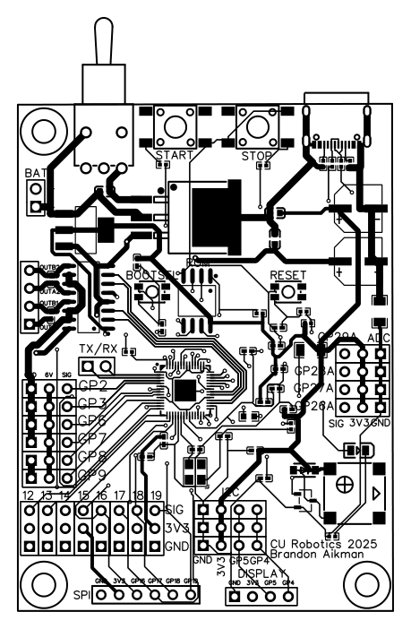
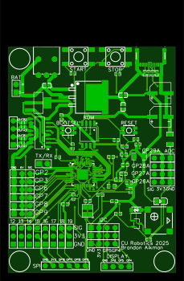
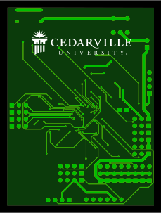
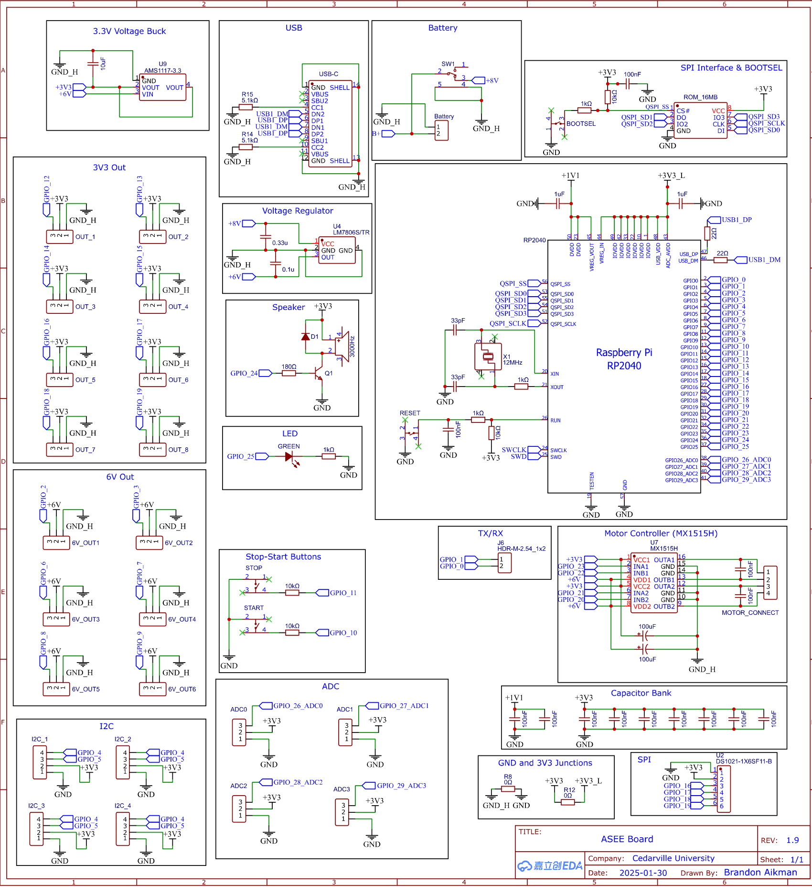

# RP2040 Robot Development Board

## Overview
- RP2040 based robot devlopment board.
- Schematic design and PCB layout created using EasyEDA, and manufactured by JLCPCB.
- Developed between October 2024 and January 2025, undergoing 9 revisions. 
- Part of Cedarville University's first-place winning autonomous robots in July 2025.
- Cost: ~$18 to manufacture (assuming at least 5 are ordered)

## Features
- RP2040 MCU
- 128MB on-board memory
- Support for 8V batteries
- Integrated MX1515h motor controller
    - Supports up to two external motors natively, with potential to add more
- 6/3.3V Rails
- Dedicated I2C channels
    - Dedicated SSD1306 OLED display slot
- Piezoelectric speaker
- USB-C connectivity
- Four on-board buttons
    - "Start"
    - "Stop"
    - Bootsel
    - Reset
- Status LEDs
- Dedicated SPI pins

## Considerations
- "Heavy" voltage and ground traces.
- "Light" voltage and ground traces.
- Intentional placement of these heavy and light traces to keep similar voltages close
- Added speaker for live awareness and notifications on the status of the robot.
- Board *must* have power to interact with USB; USB intentionally cannot power the board.
- Made for autonomous robotics.

## Challenges
- Routing the traces proved to be difficult because certain components needed to be located in specific places on the board. For example:
    - The clock and memory need to be close to the MCU.
    - The voltage buck, power switch, and motor controller need to be close to the power source.
    - The power switch, start and stop buttons, and the USB-C port need to be on the top of the board for a better user-experience.
- When we received the board, the only major error was in the routing of the start and stop buttons. This was a simple fix, I just unsoldered them and resoldered them rotated 90 degrees.
- There appears to be some minor signal crosstalk between two GPIO signal traces.
- The dedicated display port interferes with the SPI bus due to its physical proximity.

## Future Design Goals
- Add proper ground/power planes.
- Add a second on-board motor controller.
- Potentially upgrade to RP2350!
- Add WiFi/Bluetooth support to enable communication between multiple robots/hosts.
- Move display port.
- Add more LEDs for 6/3.3V statuses.
- Clean up traces.

### Top view of routing and components

### Top view of bare PCB

### Bottom view of bare PCB

### Schematic drawing
